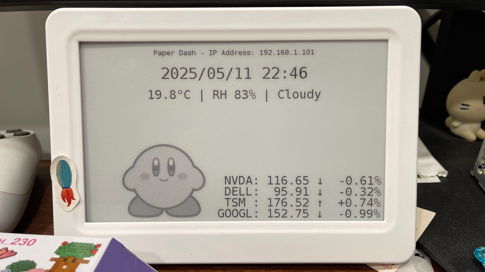

# PaperDash

**PaperDash** is a Python-based e-Paper dashboard for Raspberry Pi Zero WH with a Waveshare 7.5" e-Paper V2 display.  
It shows:

- 📡 IP Address
- 🕒 Date & Time
- 🌤️ Current weather
- 📈 Live stock prices (NVDA, DELL, etc.)
- 🖼️ A custom BMP logo

All content is updated using partial refresh to minimize flicker and power use.

---

## 🧰 Features

- Partial refresh display (no flicker)
- Realtime IP + clock (auto updates)
- Weather from [Open-Meteo](https://open-meteo.com/)
- Stock prices via Yahoo Finance API
- Configurable symbols, intervals, logo path via `config.json`
- Centered & aligned monospace layout
- Graceful exit with `Ctrl+C` → auto-sleep

---

## 🖥️ Hardware Requirements



- Raspberry Pi Zero WH (or any Pi with SPI)
- Waveshare 7.5" e-Paper Display V2 (black & white)
- BMP logo (suggested size ≤ 400×200)
- Internet connection (Wi-Fi or LAN)

---

## 📦 Project Structure

```
PaperDash/
├── paperdash.py           # Main loop
├── epd/
│   └── epd7in5_V2.py      # Waveshare driver
├── modules/
│   ├── config.py
│   ├── weather.py
│   ├── stocks.py
│   ├── network.py
│   └── clock.py
├── assets/
│   ├── config.json
│   └── logo.bmp
└── README.md
```

---

## ⚙️ Configuration (`assets/config.json`)

```json
{
  "weather_update_interval": 5,
  "stock_update_interval": 5,
  "logo_path": "assets/logo.bmp",
  "stocks": ["NVDA", "DELL", "TSM", "GOOGL"]
}
```

- Units: minutes
- Logo must be BMP format (1-bit or grayscale)
- Stock symbols must exist on Yahoo Finance

---

## 🛠️ Installation

```bash
sudo apt update
sudo apt install python3-pip python3-pil python3-requests
```

Clone your repo:

```bash
git clone https://github.com/yourname/PaperDash.git
cd PaperDash
```

---

## 🖼️ Setting Up Waveshare Driver

- Download the official Python drivers from [Waveshare GitHub](https://github.com/waveshare/e-Paper)
- Copy `epd7in5_V2.py` into `epd/` folder

---

## 🚀 Run It

```bash
python3 paperdash.py
```

- Auto-refreshes every 10s
- Ctrl+C to exit → enters deep sleep

---

## 📜 License

MIT License  
Copyright (c) 2025  
See [LICENSE](LICENSE) for details.

---

## 👥 Credits

This project was designed and implemented collaboratively by  
**Edward Lin** and **ChatGPT (OpenAI)** in 2025.

All code was written from scratch and iteratively refined through interactive development, testing, and hardware validation.

